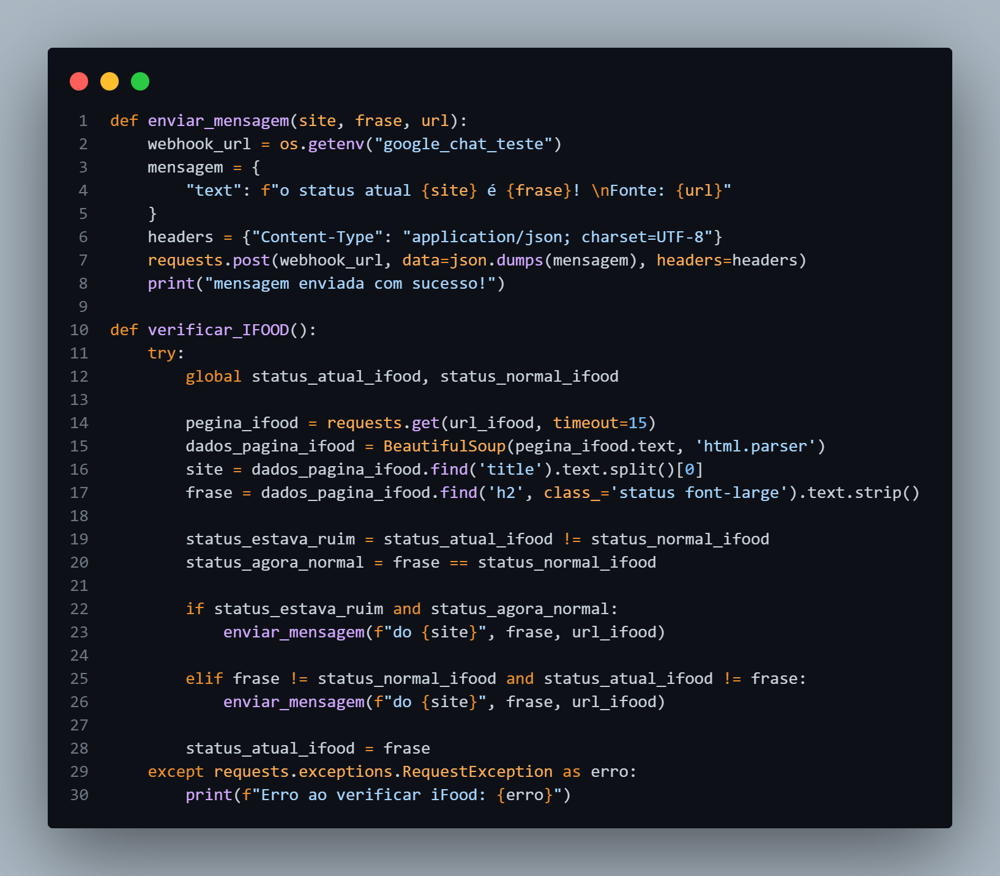
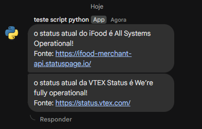

# Monitoramento de Status - VTEX e iFood

Este script em Python monitora automaticamente o status das plataformas **VTEX** e **iFood**.  
Sempre que houver alguma instabilidade detectada, ele envia uma notificação via **Google Chat Webhook**.

---

## 📋 Funcionalidades
- Monitora o status das páginas:
  - [VTEX Status](https://status.vtex.com/)
  - [iFood Merchant API Status](https://ifood-merchant-api.statuspage.io/)
- Verifica o status a cada 1 minuto (`60 segundos`).
- Caso detecte problemas nos serviços:
  - Envia um alerta para o Google Chat.

---
## 📸 Demonstração

<div style="display: flex; gap: 20px; flex-wrap: wrap; justify-content: center;">

   <div style="flex: 1; min-width: 300px; text-align: center;">
    <strong>Exemplo do código (função de envio e verificação do iFood):</strong><br><br>
    
  </div>
  
  <div style="flex: 1; min-width: 300px; text-align: center;">
    <strong>Notificação recebida no Google Chat:</strong><br><br>
    
  </div>
</div>


---

## 🛠️ Tecnologias utilizadas
- Python 3.12+
- Bibliotecas:
  - `requests`
  - `beautifulsoup4`
  - `dotenv` (opcional para variáveis de ambiente)


---

## ⚙️ Como usar

1. **Clone o repositório**:
   ```bash
   git clone https://github.com/seu-usuario/Monitoria-status-iFood-VTEX.git
   ```

2. **Instale as dependências**:
   ```bash
   pip install -r requirements.txt
   ```

3. **Configure o Webhook do Google Chat**:
   - No script, edite a variável `webhook_url` com o seu link de Webhook do Google Chat.

4. **Execute o script**:
   ```bash
   python main.py
   ```


---

## 🔥 Observações
- **Timeout** de 15 segundos foi configurado nas requisições para evitar travamentos.

- O script está preparado para **erros de rede** sem interromper a execução.

---

## 🚀 Melhorias futuras (sugestões)
- Salvar logs em arquivo para histórico de alertas.
- Adicionar suporte a múltiplos canais de notificação (ex: Slack, Telegram).
- Implementar monitoramento de mais serviços além de VTEX e iFood.

---

## 👨‍💻 Autor
**Jhonata Santos**  
Feito com dedicação para automação de monitoramento.

---

# 📢 Aviso
Este projeto é destinado a **uso pessoal ou interno**.  
Para uso em produção, recomenda-se melhorias adicionais de robustez e segurança.
